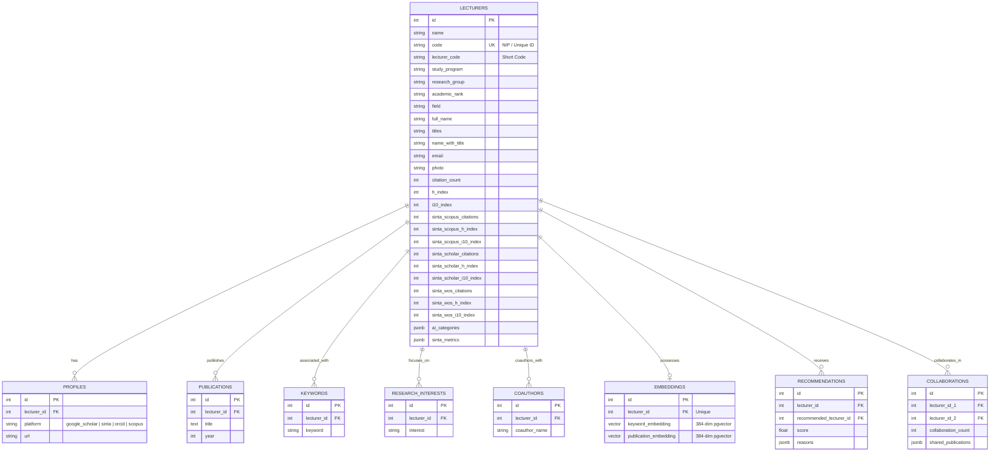
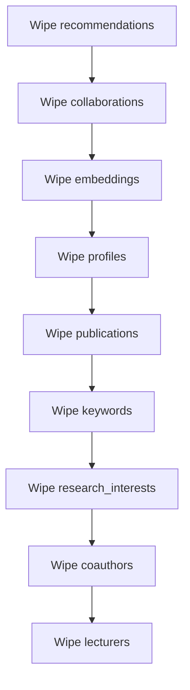

# PostgreSQL Database Schema & Documentation
This document outlines the database schema, table structures, relationship mapping, and indexes of the **Lecturer Profiling and Collaboration System** for the Faculty of Informatics (FIF), Telkom University.

---

## 1. Relational Entity-Relationship Diagram (ERD)

---

## 2. Table Specifications

### 2.1 `lecturers`
Stores primary profile details, SINTA metrics, and parsed research classifications.
*   **Primary Key:** `id` (Serial)
*   **Constraints:** `code` is UNIQUE.

| Column | Type | Default / Null | Description |
| :--- | :--- | :--- | :--- |
| `id` | `INTEGER` | `SERIAL PRIMARY KEY` | Internal database auto-increment identifier |
| `name` | `VARCHAR` | `NULL` | Base name |
| `code` | `VARCHAR` | `UNIQUE` | Unique identifier (usually NIP) |
| `lecturer_code` | `VARCHAR` | `NULL` | Three-letter initials / academic code |
| `study_program` | `VARCHAR` | `NULL` | Faculty study program |
| `research_group` | `VARCHAR` | `NULL` | Assigned research group (CITI, DSIS, SEAL) |
| `academic_rank` | `VARCHAR` | `NULL` | Academic position rank (LEKTOR, etc.) |
| `field` | `VARCHAR` | `NULL` | Broad scientific area of expertise |
| `full_name` | `VARCHAR` | `NULL` | Full name without prefix titles |
| `titles` | `VARCHAR` | `NULL` | List of degree qualifications |
| `name_with_title` | `VARCHAR` | `NULL` | Formatted official name |
| `email` | `VARCHAR` | `NULL` | Academic email address |
| `photo` | `VARCHAR` | `NULL` | Path / URL to profile picture |
| `citation_count` | `INTEGER` | `0` | Overall cumulative citation count |
| `h_index` | `INTEGER` | `0` | Cumulative h-index |
| `i10_index` | `INTEGER` | `0` | Cumulative i10-index |
| `sinta_scopus_citations` | `INTEGER` | `0` | Scopus citations (from SINTA) |
| `sinta_scopus_h_index`| `INTEGER` | `0` | Scopus h-index |
| `sinta_scholar_citations`| `INTEGER` | `0` | Scholar citations |
| `sinta_wos_citations` | `INTEGER` | `0` | Web of Science citations |
| `ai_categories` | `JSONB` | `'[]'::jsonb` | Extracted AI subfields |
| `sinta_metrics` | `JSONB` | `'{}'::jsonb` | Granular yearly metrics |

---

### 2.2 `profiles`
Stores external URLs pointing to Google Scholar, SINTA, ORCID, and Scopus.
*   **Foreign Key:** `lecturer_id` referencing `lecturers.id` (ON DELETE CASCADE)

| Column | Type | Constraints | Description |
| :--- | :--- | :--- | :--- |
| `id` | `INTEGER` | `SERIAL PRIMARY KEY` | Auto-increment key |
| `lecturer_id` | `INTEGER` | `FOREIGN KEY` | Link to lecturer profile |
| `platform` | `VARCHAR` | `NULL` | E.g., `google_scholar`, `sinta`, `orcid`, `scopus` |
| `url` | `VARCHAR` | `NULL` | Web URL string |

---

### 2.3 `publications`
Stores individual academic papers published by lecturers.
*   **Foreign Key:** `lecturer_id` referencing `lecturers.id` (ON DELETE CASCADE)

| Column | Type | Constraints | Description |
| :--- | :--- | :--- | :--- |
| `id` | `INTEGER` | `SERIAL PRIMARY KEY` | Auto-increment key |
| `lecturer_id` | `INTEGER` | `FOREIGN KEY` | Link to authoring lecturer |
| `title` | `TEXT` | `NULL` | Complete title of publication |
| `year` | `INTEGER` | `NULL` | Publication year |

---

### 2.4 `keywords` & `research_interests`
Hold scientific tags extracted from profiles/papers.
*   **Foreign Key:** `lecturer_id` referencing `lecturers.id` (ON DELETE CASCADE)

| Column | Type | Constraints | Description |
| :--- | :--- | :--- | :--- |
| `id` | `INTEGER` | `SERIAL PRIMARY KEY` | Auto-increment key |
| `lecturer_id` | `INTEGER` | `FOREIGN KEY` | Link to lecturer |
| `keyword` / `interest`| `VARCHAR` | `NULL` | Extracted keyword or interest tag |

---

### 2.5 `coauthors`
Extracted list of co-authors parsed from publication metadata.
*   **Foreign Key:** `lecturer_id` referencing `lecturers.id` (ON DELETE CASCADE)

| Column | Type | Constraints | Description |
| :--- | :--- | :--- | :--- |
| `id` | `INTEGER` | `SERIAL PRIMARY KEY` | Auto-increment key |
| `lecturer_id` | `INTEGER` | `FOREIGN KEY` | Link to main lecturer |
| `coauthor_name` | `VARCHAR` | `NULL` | Co-author's name string |

---

### 2.6 `embeddings`
Stores vector embeddings generated from research profiles. Used to compute semantic similarities.
*   **Requirement:** Relies on the `pgvector` PostgreSQL extension.
*   **Foreign Key:** `lecturer_id` referencing `lecturers.id` (ON DELETE CASCADE, UNIQUE)

| Column | Type | Constraints | Description |
| :--- | :--- | :--- | :--- |
| `id` | `INTEGER` | `SERIAL PRIMARY KEY` | Auto-increment key |
| `lecturer_id` | `INTEGER` | `FOREIGN KEY, UNIQUE`| Link to lecturer profile |
| `keyword_embedding` | `vector(384)` | `NULL` | 384-dimensional dense vector of keywords |
| `publication_embedding`| `vector(384)` | `NULL` | 384-dimensional dense vector of publications |

---

### 2.7 `recommendations`
Stores precomputed collaboration recommendation pairs.
*   **Foreign Keys:** Both `lecturer_id` and `recommended_lecturer_id` reference `lecturers.id` (ON DELETE CASCADE).

| Column | Type | Constraints | Description |
| :--- | :--- | :--- | :--- |
| `id` | `INTEGER` | `SERIAL PRIMARY KEY` | Auto-increment key |
| `lecturer_id` | `INTEGER` | `FOREIGN KEY` | Link to querying lecturer |
| `recommended_lecturer_id`| `INTEGER`| `FOREIGN KEY` | Link to recommended lecturer |
| `score` | `FLOAT` | `NULL` | Similarity match score |
| `reasons` | `JSONB` | `NULL` | Bulleted list of reasons for recommendation |

---

### 2.8 `collaborations`
Stores direct co-authorship relationships between faculty members.
*   **Foreign Keys:** Both `lecturer_id_1` and `lecturer_id_2` reference `lecturers.id` (ON DELETE CASCADE).

| Column | Type | Constraints | Description |
| :--- | :--- | :--- | :--- |
| `id` | `INTEGER` | `SERIAL PRIMARY KEY` | Auto-increment key |
| `lecturer_id_1` | `INTEGER` | `FOREIGN KEY` | First collaborating lecturer ID |
| `lecturer_id_2` | `INTEGER` | `FOREIGN KEY` | Second collaborating lecturer ID (guaranteed `id_1 < id_2`) |
| `collaboration_count` | `INTEGER` | `DEFAULT 1` | Total count of co-authored papers |
| `shared_publications` | `JSONB` | `NULL` | Array of co-authored paper titles |

---

## 3. Relational Cleanup & Population Order
To prevent foreign key violations, the sync script (`save_to_db.py`) drops and populates tables in the following strict order:

---

## 4. Query Performance Optimization (Indexes)
Standard B-Tree indexes are defined to maximize search performance for filtering and dashboard rendering:
*   `idx_profiles_lecturer_id` on `profiles(lecturer_id)`
*   `idx_publications_lecturer_id` on `publications(lecturer_id)`
*   `idx_keywords_lecturer_id` on `keywords(lecturer_id)`
*   `idx_research_interests_lecturer_id` on `research_interests(lecturer_id)`
*   `idx_coauthors_lecturer_id` on `coauthors(lecturer_id)`
*   `idx_recommendations_lecturer_id` on `recommendations(lecturer_id)`
*   `idx_collaborations_lecturer_id_1` on `collaborations(lecturer_id_1)`
*   `idx_collaborations_lecturer_id_2` on `collaborations(lecturer_id_2)`
